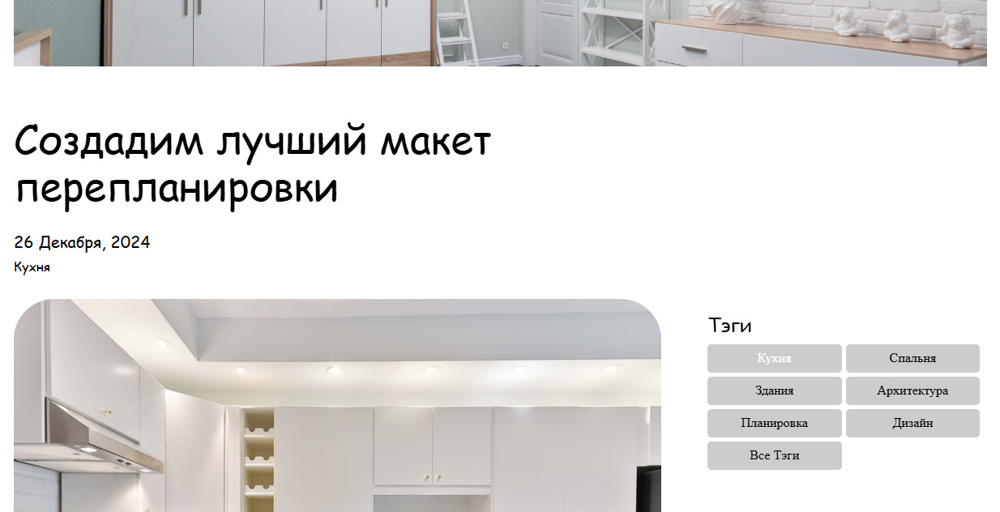

# Фреймворк Vue.js. Обучение в записи

# Урок 6. Семинар: Компоненты
## Работа с макетом

Продолжаем работу с макетом: Реализовать страницу Blog Details (Домашнее задание 3).<br>
На странице отображается подробное описание статьи, а под ней размещаются остальные статьи.<br> Необходимо, чтобы на выборе “Тэги” происходила сортировка статей по выбранному тегу.<br>
Тег можно выбрать только один.
<br>
<br>

#### Задание по работе с макетом направлено на подготовку проекта к итоговой аттестации.

<br>
<br>

#### Формат сдачи: ссылка на гитхаб.

<br>
<br>
<br>
<br>

### Решение задания

1. Собираем страницу html как верстку по представленному макету.
2. Подключаем в конце header необходимого файла Vue.js второй версии
```
<script src="https://cdn.jsdelivr.net/npm/vue@2"></script>
```
3. Если требуется много контента для страницы, создаем папку js, в ней создаем файл app.js для создания контента в массиве.
4. В первом div после тэга body указываем id="app"
```
<div id="app" class="wrapper">
```
5. Подключаем файл app.js перед закрывающим тэгом body
```
<script src="js/app.js"></script>
```
6. Между открывающим и закрывающим тэгом блока с постами устанавливаем Vue-компонент
```
<blog-posts :posts="filteredPosts"></blog-posts>
```
7. Свойство posts будет отображать список статей по определенному свойству для filteredPosts <br>
   (фильтрация статьи в зависимости от выбранного тега). <br> 
   Когда свойство filteredPosts обновляется, компонент blog-posts будет отображать данные статей из файла app.js. <br><br>

8. В разметку sidebar указываем компоненты для выбора фильтра по кнопкам, <br> 
для выбора "Все Тэги" указываем пустой фильтр, <br>
чтобы отображать все содержимое блока постов при клике на соответствующую кнопку.
```

<button v-for="tag in tags" :key="tag" @click="filterPosts(tag)">{{ tag }}</button>
<button @click="filterPosts('')">Все Тэги</button>
```
9. Далее указываем элементы для файла app.js, где размещаем вычисляемые свойства - для решения задачи вычисления, методы, где помещаем возможность выбора тэга, указываем компоненты, возникающие в разметке в виде данных каждого поста в блоке класса blog-details и, собственно, свойства повторяющейся разметки в template
```
template: `
    <div>
        <div v-for="post in posts" :key="post.title">
            <h2>{{ post.title }}</h2>
            <p class="blog-details__article-date">{{ post.date }}</p>
            <p class="blog-details__article-tags">{{ post.tag }}</p>
            <div v-for="(content, index) in post.content" :key="index">
                <picture v-if="content.type === 'img'">
                    
                </picture>
                <p v-if="content.type === 'text'" class="blog-details__article-text">{{ content.text }}</p>
            </div>
        </div>
    </div>
`
```

10. После выбора при нажатии кнопки (при клике) определенного тэга по его уникальному ключу :key="tag" в массиве tags.
вызывается метод filterPosts с текущим тегом и его содержимым в массиве. Для создания элементов на основе массива tags используется директива v-for
```
v-for="tag in tags"
```
11. Выбранный элемент разметки выводится на странице html




<br><br><br><br>
